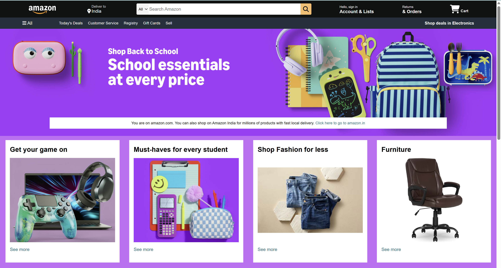
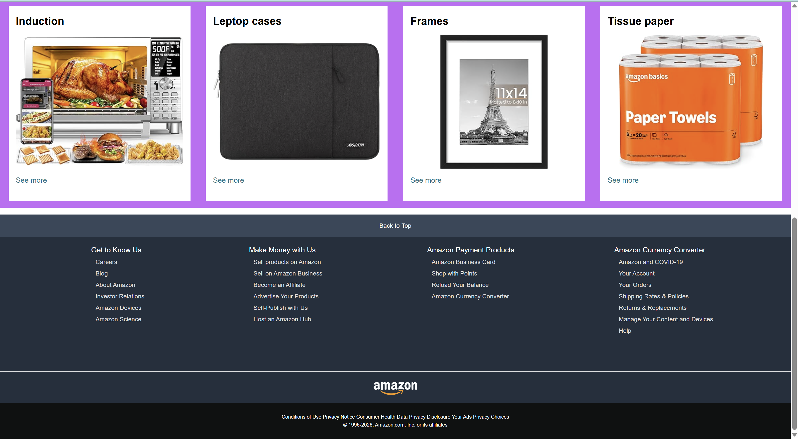

# 🛒 Amazon Clone

A responsive Amazon homepage clone built using **HTML5** and **CSS3**. This project recreates the look and feel of Amazon's homepage to practice frontend web development and responsive design.

## Features

- Responsive Navigation Bar
- Hero Section
- Product Cards
- Search Bar UI
- Footer Section
- Font Awesome Icons
- Clean and Responsive Layout

## Technologies Used

- HTML5
- CSS3
- Font Awesome

## 📂 Project Structure

```
amazon-clone/
│── img/
│── index.html
│── style.css
│── README.md
```

## Screenshot





## Purpose

This project was created to improve my HTML and CSS skills by building a clone of a real-world website.

## 👨‍💻 Author

**Kalp Prajapati**

- GitHub: https://github.com/kalpprajapati

## ⭐ If you like this project

Give this repository a ⭐ on GitHub!
